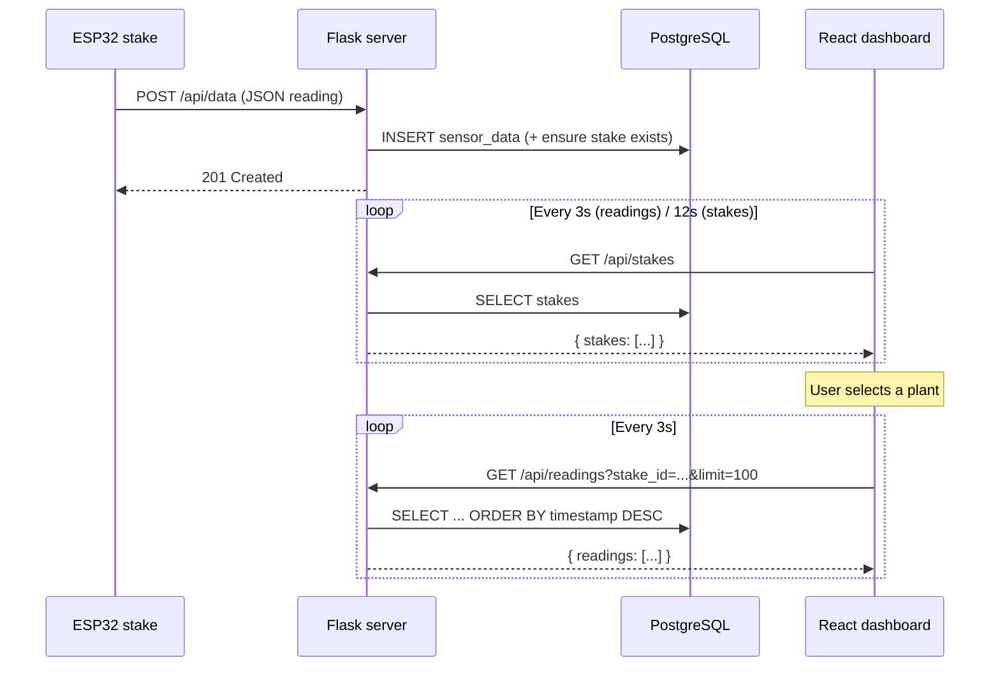

# Data flow

How a sensor reading gets from soil to your screen.

## Sequence



## JSON shapes

### Device → server (`POST /api/data`)

```json
{
  "stake_id": "STAKE_C3_001",
  "moisture": 1842,
  "lux": 1200,
  "temperature": 21.5,
  "humidity": 45.0
}
```

Optional `species` on POST can set or upgrade the plant name on the stake record.

### Server → dashboard (`GET /api/readings`)

```json
{
  "status": "success",
  "readings": [
    {
      "id": 42,
      "timestamp": "2026-07-04T22:01:00Z",
      "stake_id": "STAKE_C3_001",
      "moisture": 1842,
      "lux": 1200,
      "humidity": 45.0,
      "temperature": 21.5
    }
  ]
}
```

Readings are **newest first** (`readings[0]` is the latest).

### Server → dashboard (`GET /api/stakes`)

```json
{
  "status": "success",
  "stakes": [
    { "stake_id": "STAKE_C3_001", "species": "Basil" }
  ]
}
```

## Polling strategy (frontend)

| Data | Interval | Why |
|------|----------|-----|
| Stakes list | 12 s (`POLL_INTERVAL_MS * 4`) | Plants change rarely; slower poll saves requests |
| Readings for selected plant | 3 s | User expects near-live telemetry |

## CORS

The Flask app allows `http://localhost:5173` (Vite dev server). The frontend API base URL defaults to `http://localhost:8080` unless `VITE_API_BASE_URL` is set.
